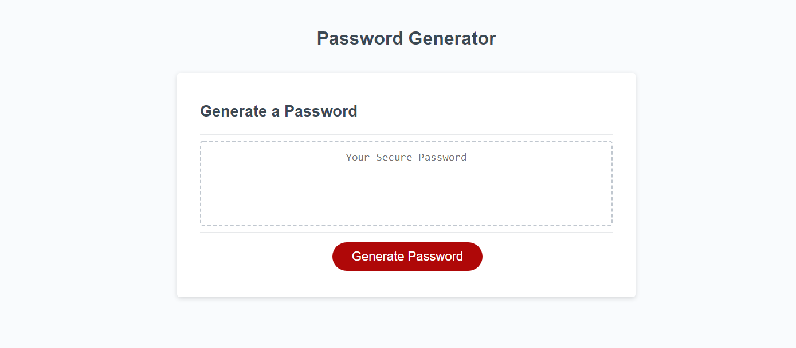

# Passowrd Generator 

## Key Features

➕ When clicking the button to generate a password, you're presented with a series of prompts for password criteria

➕ When prompted for password criteria, then select which criteria to include in the password

➕ When prompted for the length of the password, then choose a length of at least 8 characters and no more than 128 characters

➕ When asked for character types to include in the password, then confirm whether or not to include lowercase, uppercase, numeric, and/or special characters

➕ When you answer each prompt, then your input should be validated and at least one character type should be selected

➕ When all prompts are answered then a password is generated that matches the selected criteria

➕ When the password is generated then the password is either displayed in an alert or written to the page

### Link to deployed site https://michaeldigi.github.io/password-gen/
